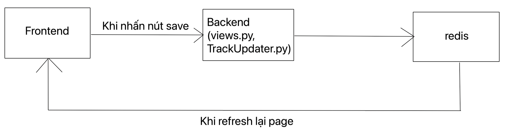

# modified CVAT

Đây là phiên bản CVAT đã được thêm vào các chức năng sau:

- Merge các bounding box có sẵn thành track
- Merge 2 track thành 1 track
- Merge bbox riêng lẻ vào track có sẵn
- Interpolate các bounding box bị thiếu

So với cách label truyền thống (annotator phải merge từng bbox), cách mới này chỉ yêu cầu annotator merge các bbox ở các frame cách nhau một khoảng (e.g. merge các bbox mỗi 5 frames) và thuật toán sẽ tự động merge và interpolate.

## Cách build

Chỉ cần chạy lệnh mặc định sau:

> docker-compose up -d

## Flow xử lí

Về cơ bản, tiến trình merge/interpolate các bbox sẽ diễn ra ở phần backend như ở sơ đồ dưới đây:

## Cấu trúc các file

Có 2 file cần quan tâm:

- `cvat/apps/engine/views.py`
- `utils/track_updater/TrackUpdater.py`

File `views.py`, hàm `annotations` trong class `JobViewSet` chứa phần xử lí cho từng loại request tương ứng gửi từ frontend.

File `TrackUpdater.py` chứa các module để merge cũng như interpolate các bbox.

## Hướng dẫn sử dụng

0. Chỉnh _Player step_ trong setting về _5_ (5 là recommended, có thể tăng)

#### Đối với chức năng Merge các bbox:

1. Nhảy đến frame chứa bbox đầu tiên của object
2. Bật chức năng Merge bằng cách nhấn phím M trên bàn phím
3. Chọn bbox của object
4. Nhấn phím V để nhảy tới frame cách frame hiện tại 5 frame, rồi chọn bbox của object
5. Tiếp tục bước 4 cho đến khi đến frame có chứa bbox cuối cùng của object
6. Nhấn phím M để thoát khỏi chức năng Merge
7. Nhấn nút Save
8. Reload lại page

#### Đối với chức năng Merge các track riêng lẻ:

Cần lưu ý rằng CVAT đánh dấu việc kết thúc của một track bằng một bbox có thuộc tính **Outside** là _True_ (mình tạm gọi là _bbox kết thúc_ và frame chứa _bbox kết thúc_ là _frame kết thúc_), nên để merge track, phải bắt đầu từ frame liền trước _frame kết thúc_.

Giả sử mình cần merge track A và B.

1. Nhảy đến frame liền trước _frame kết thúc_ của track A
2. Nhấn nút M trên bàn phím để bật chức năng Merge
3. Nhảy đến frame bắt đầu track B
4. Chọn bbox của track B
5. Nhấn nút Save
6. Reload lại page

#### Đối với chức năng Merge các bbox riêng lẻ vào track:

1. Nhảy đến frame liền trước _frame kết thúc_ của track cần thêm bbox
2. Nhấn phím M trên bàn phím để bật chức năng Merge
3. Nhảy đến frame có chứa bbox cần merge
4. Chọn bbox cần merge vào track
5. Lặp lại bước 4 đến khi muốn dừng thì nhấn phím M để thoát chức năng merge
6. Nhấn nút Save
7. Reload lại page

Một lưu ý là giả sử track đến frame 100 là kết thúc, bbox của object xuất hiện ở frame 101 -> 110 thì nếu mình áp dụng quy trình trên với frame 110 thì các bbox từ frame 101 -> 109 cũng sẽ tự động được merge vào track.
